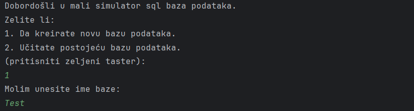
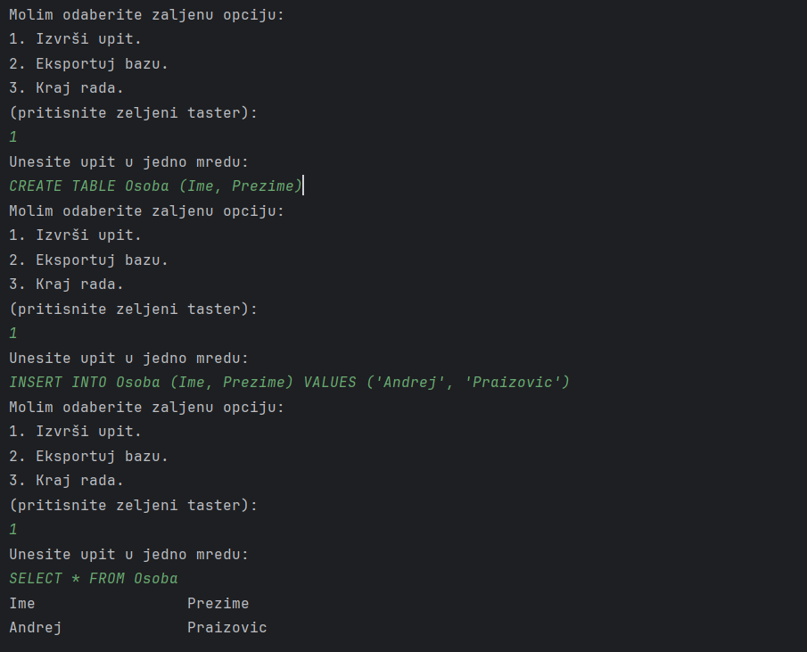
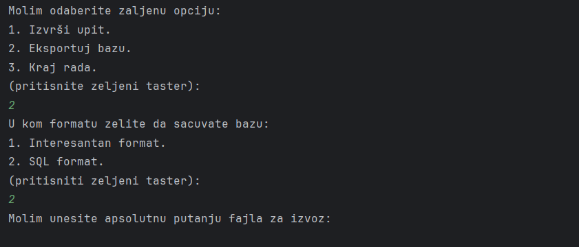

## 📋 Table of Contents
- [Features](#features)
- [How It Works](#how-it-works)
- [Prerequisites](#prerequisites)
- [Example Usage](#example-usage)   

---

## 🔧 Features

- Interactive **numbered menu** for all actions  
- Create new SQL databases  
- Import existing SQL files  
- Execute SQL queries directly in the terminal  
- Display query results in a readable format  
- Export databases or results to multiple formats 
- Lightweight, minimalistic C++ implementation  
- No complex flags or commands needed

---

## 🧭 How It Works 

When you launch the program, you are presented with a starting prompt:

Then you interact with a simple, user-friendly menu:

Just type a number (e.g., `1`, `2`, `3`) and follow the prompts.

---

## 📦 Prerequisites

- C++ compiler (GCC, Clang, MSVC, etc.)
- CMake
- Standard C/C++ libraries

---

## 🚀 Example Usage

When you're done it's easy to export your work:

At the end, you just insert the absolute path to the file.
